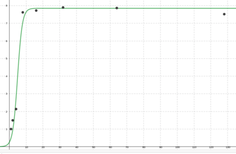
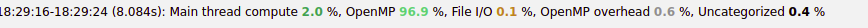
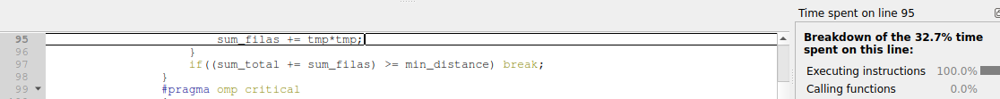
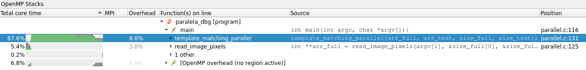

## Laboratorio IV Sistemas Operativos 2 - Francisco Daniele
### Ingeniería en Computación - FCEFyN - UNC
# Memoria compartida

**Índice**   
1. [Desarrollo](#id1)
2. [Formato de la imagen](#id2)
3. [Algoritmo](#id3)
4. [Optimizaciones](#id4)
5. [Paralelizacion](#id5)
6. [Profiling](#id6)
7. [Testing](#id7)

## Desarrollo<a name="id1"></a>
La organización del desarrollo de este laboratorio es la siguiente:
```text
├── .docimg             -> imagenes para el informe
├── img                 -> imagenes para pattern matching
├── profiling           -> resultados de profiling
├── src
│    ├── bin            -> archivos binarios
│    ├── img_to_dots.py -> lee una imagen, la convierte a una matriz en greyscale y la escribe en un archivo
│    ├── parallel.c     -> pattern matching de imagenes paralelizado
│    └── procedural.c   -> pattern matching de imagenes procedural
├── get_img_pixels.sh   -> script para ejecutar _img_to_dots.py_ sobre 2 imagenes
├── makefile            -> genera todo lo necesario para el desarrollo del trabajo
├── README.md           -> informe de lo realizado
└── test.sh             -> para testing de los programas paralelo y procedural
```

### Instrucciones
-   crear ejecutables 
```text
$ make
```
-   generar matrices greyscale de una imagen
```text
$ python3 ./src/img_to_dots.py [img path] [output file] [show|noshow]
```
-   ejecutar programa procedural
```text
$ ./src/bin/procedural [full img matrix txt file] [template img matrix txt file]
```
-   ejecutar programa paralelo
```text
$ ./src/bin/paralela [full img matrix txt file] [template img matrix txt file]
```
-   ejecutar ambos con las imagenes por defecto del laboratorio 
```text
$ ./test.sh L . [show|noshow]
```

## Formato de la imagen<a name="id2"></a>
Para obtener una representacion amigable de la imagen desarrolle un pequeño script en python que se sirve de la libreria OpenCV. 

Este script lee una imagen que le pasamos como argumento al programa y la transforma a una matriz en escala de grises. Luego escribe en un archivo de texto las dimensiones de la imagen de la forma "_height_ _width_" y linea por linea el valor de gris de cada pixel de la imagen.
Por último, opcionalmente se muestra la imagen leída.

Para poder trabajar con dicha matriz, el programa en C, mediante la funcion _read_image_pixels_ hace lo siguiente:
-   Lee el archivo de texto con la matriz de los pixeles
-   Guarda en punteros recibidos como parametros las dimensiones de la matriz
-   Aloca la memoria necesitada para poder guardar todos los valores
-   Lee linea por linea el texto mediante _getline_
-   Lee cada valor de la linea obtenida, lo convierte a _int_ y lo guarda en la posicion adecuada en la matriz
-   Devuelve la matriz alocada y rellenada

## Algoritmo<a name="id3"></a>
Siguiendo e interpretando las instrucciones en la consigna del laboratorio llegué un algoritmo que, aunque muy lentamente, resolvía el problema:
-   Se crea una ventana del tamaño del patron que se quiere encontrar en la imagen completa
-   Con un doble for loop se va recorriendo toda la matriz de la imagen completa hasta los limites en _x_ e _y_ menos los respectivos valores de ancho y alto del template.
-   Con otro doble for loop interior se llena a la ventana creada con los valores de la imagen original del cuadro en que nos encontramos y se procede a calcular la distancia euclideana del pixel que estamos viendo de la imagen completa con el que le correspondería en el template. Cada distancia se suma por fila y despues al final se suman todas las distancias de cada fila y obtenemos la distancia total de la ventana comparada de la imagen completa con respecto al template. Una vez la tenemos, comparamos con el mínimo obtenido anteriormente. Al final tenemos el valor de la minima distancia y la esquina superior izquierda de donde se encuentra en la imagen completa. 

## Optimizaciones<a name="id4"></a>
Si bien el algoritmo funcionaba y daba resultados correctos, cuando se trataba de imagenes relativamente grandes el tiempo de ejecución era de varios minutos. Por eso seguí tratando de optimizarlo, siendo las siguientes algunas de las optimizaciones:
-   eliminar operaciones y asignaciones innecesarias
-   a medida de que va sumando la distancia comparar con el mínimo anterior, si ya se pasó se descarta esa iteración y se pasa a la siguiente
-   _atoi_ vs _naive_: realicé el profiling de la función _read_image_pixels_ con estas distintas formas de convertir string a int, obteniendo con _atoi_ un tiempo promedio de la función de 1.6 segs con la función significando el 41% de ese tiempo, y con _naive_ un promedio de 0.74 segs y un 30.6% de ese tiempo lo usa la función.

De esta manera pude lograr bajar los tiempos de ejecución al orden de los segundos, en promedio aproximadamente 24 s.

## Paralelizacion<a name="id5"></a>
Una vez que tuve un algoritmo serial con el que estaba conforme, me dediqué a paralelizarlo mediante OpenMP para obtener mejores resultados en performance. 
Lo primero fue ver donde estaban los hotspots del programa y trabajar sobre ellos.
-   Por lejos, el mayor consumo de tiempo de ejecución se da en la función _template_matching_ que es donde se realiza el algoritmo. Al haber 4 nested fors lo que hice fue crear una sección paralela que los englobe e ir haciendo profiling de paralelizar cada for con distintos schedules y clausulas. Encontré que la mayor performance la obtengo cuando paralelizo el for más externo:
    -   _schedule dynamic_ para que cuando un thread termine no tenga que esperar nada y enseguida agarre otro chunk
    -   tamaño de chunk 128 
    -   clausula _nowait_ para eliminar la barrera interna al final del for ya que no es necesaria y nos ahorramos bastante overhead
    -   tiene una sección _critical_ para calcular la minima distancia y evitar _race conditions_
-   Luego decidí paralelizar la lectura y asignacion de los pixeles de las imagenes obtenidas ya que las funciones _atoi_ y _strtok_ consumían un tiempo considerable. Para eso cree una seccion paralela que engloba un for:
    -   clausula _ordered_ ya que necesito leer en orden las filas del archivo de texto leido
    -   _schedule static_ ya que van a entrar en orden.
    -   tamaño de chunk 1 porque si fuera mas grande cada thread deberia esperar a que termine el anterior por la clausula _ordered_
    -   clausula _nowait_ para eliminar la barrera interna al final del for ya que no es necesaria y nos ahorramos bastante overhead

### Speedup
A continuacion se muestra un grafico donde se compara el speedup obtenido del programa paralelo con distinta cantidad de threads respecto del serial.
```
| N° threads| speedup |
|-----------|---------|
| 1         | 1       |
| 2         | 1.5     |
| 4         | 2.134   |
| 8         | 7.62    |
| 16        | 7.73    |
| 32        | 7.9     |  
| 64        | 7.87    |
| 128       | 7.52    |
```



Como se observa, al poner 2 threads ya hay una mejora y fui haciendo profiling con 2^n numero de threads para ver el maximo rendimiento practico para este problema con esta implementación. Vemos que el pico se alcanza con 32 threads, y a partir de ahí la mejora empieza a decaer porque lo que se gana en velocidad de computo ya es menor que lo que se gasta en overhead en creación, eliminación y switch de threads.

## Profiling<a name="id6"></a>
Al principio del trabajo, cuando trabaja serialmente utilizaba _gprof_ como el trabajo anterior. Luego, cuando empecé con paralelización me di cuenta que obtenía resultados incorrectos ya que gprof reporta el tiempo total de cada core utilizado. 
Luego me empecé a servir del comando _time_ para medir tiempo de ejecución y la función _omp_get_wtime_ para mayor precisión.
Para tener más detalles, me puse a investigar y encontré la herramienta _Arm MAP: Scalable Profiler for Server/HPC Developers_ que da una licensia gratis por 7 días y la utilicé mientras pude. 
Esta herramienta te da la posibilidad de hacer profiling de programas con OpenMP y te da las siguientes posibilidades:
-   Observar en que tipo de operaciones se divide el tiempo de ejecución
      
-   En que momento de la ejecución se da cada tipo de operación
        
-   ver que porcentaje del tiempo de ejecución consume cada instrucción
      
-   El porcentaje de consumo de tiempo de cada función
      

## Testing<a name="id7"></a>
Para facilitarme el desarrollo y testear las distintas versiones del programa cree dos _bash scripts_:
-   get_img_pixels: ejecuta el script python para leer las imagenes (completa y template) que se las paso como argumento
-   test.sh: ejecuta _get_img_pixels_ con las imagenes que le indique y luego ejecuta la versión paralela, procedural o ambas del programa de pattern matching y guarda su resultado en archivos de texto.